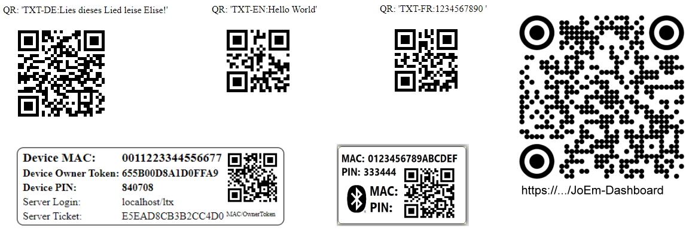

# Dashboard-Fragment #
**Fragment**

Fragment für ein Desktop/Mobile Dashboard (als PWA)

<i>Wichtig: Dieses Repo ist nur ein Fragment! Das Dashboard ist zwar voll
funktionabel (ersetzt 'BLX.JS'), es fehlen aber z.B. noch die vollständige Sprachumsetzung, 
diverse Spezial-Dialoge (z.B. Tarierung), diese können aber problemlos eingebaut werden.
Die PWA ist in reinem Vanilla-JS geschrieben.</i>

Features:
- Echte PWA - Läuft Online und Offline
- Daten Synchronisierung mit Server (wenn Internet vorhanden (geht nicht von GitHub aus!))
- Responsive: läuft auf Android und Desktop (Chrome, Edge, ...)
- Skalierbare Fonts für maximale Baustellen-Tauglichkeit
- Internationalisierung (i18-aehnlich)
- Interner QR-Code-Scanner mit Geräte-Onboading per QR
- PWA updated sich selbst jeweils auf den neueseten Stand
- Leicht erweiterbar
- ...

Live-Demo: https://joembedded.github.io/JoEm-Dashboard/app

Note: Aktivieren der Chrome-Entwickleroption: 
- Aktiviere Entwicklermodus auf Mobile in den Einstellungen 'Über das Telefon' und dann 7 Mal auf die 'Build-Nummer' tippen. Dann USB-Debugging in den Entwickleroptionen aktivieren
- 'index.html' von einem localhost auf Mobile laden
- In Chrome: chrome://inspect/#devices -> Scannt alle offen Webseiten, 'insepct' öffnet eine remote Konsole dazu.

---

## Service Worker (PWA)
Service Worker besteht aus 4 Dateien: sw.js / workbox_xx.jsm beide mit .map
Der Service Worker caached die APP-Daten, so dass sie Offline verfügbar ist.
Fuer die Entwicklung allerdings eher hinderlich... Daher deinstallierbar.
- Entwicklung: ServiceWorker-Dateien evtl. loeschen.  
    Gegebenenfalls laufenden Servicewerker manuell per Konsole löschen: removeServiceWorker() (global in 'index.html', ca. Zeile 40) 
    und 'window.jdDebug' auf > 0 setzen, bzw. bei host 'localhost' wird automatisch 'window.jdDebug' gesetzt. 
    Anmerkung: Beim der Live-Version auf GitHub ist Server-Sync blockiert, da dort kein PHP.

- Deploy: ServiceWorker-Dateien erzeugen 'workbox generateSW workbox-config.js' im Root des Projekts (siehe './docu/jo_notes/notes.txt') 
    SW-Registrierung automatisch wenn 'window.jdDebug = 0' setzen

## Test QR-Codes

Einige QR-Codes (MACs, gesprochene Texte, Link) zum Testen:

## 3.rd Party Software ##
- FontAwesome https://fontawesome.com/license/free License: MIT, SIL-OFL, CC-BY-4.0
- FileSaver https://github.com/eligrey/FileSaver.js/blob/master/LICENSE.md License: MIT
- QR-Code Scanner Polyfill: https://github.com/cozmo/jsQR License: Apache 2.0

---

## Changelog (wie 'blxDash.js') ##
- V0.16 11.06.2024
